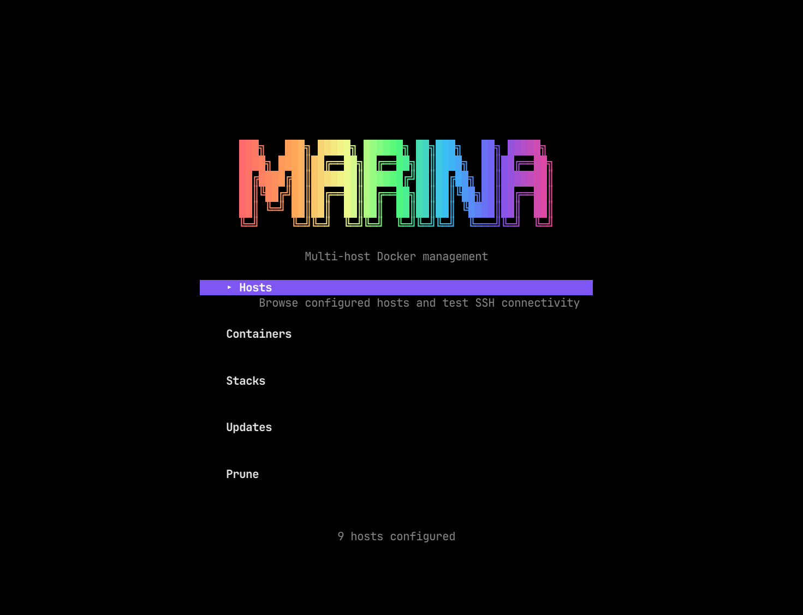
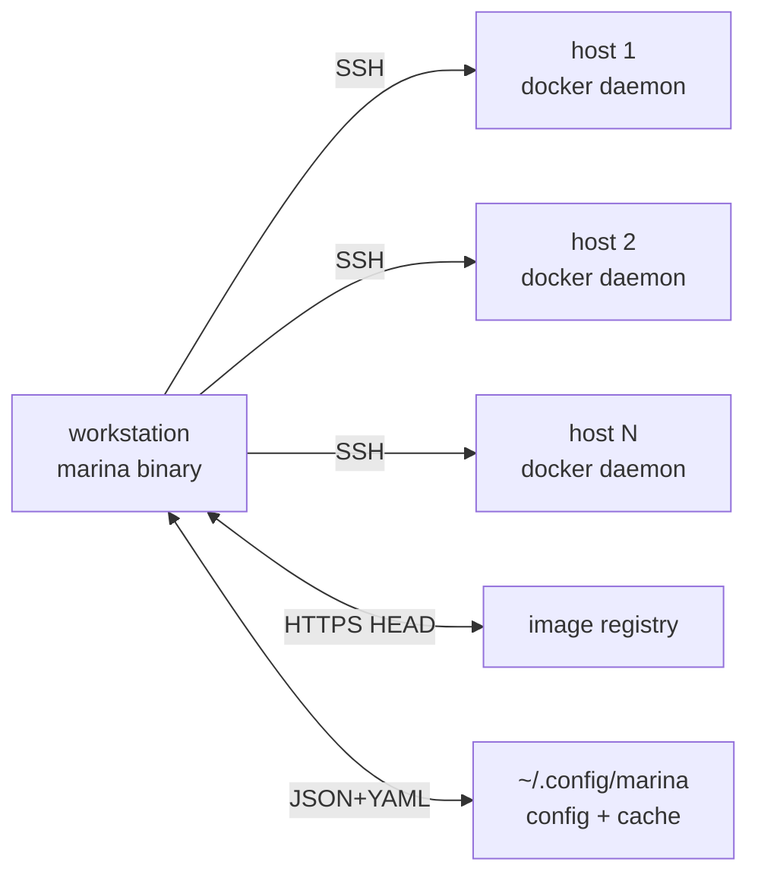

# Marina

<p align="center">
  
</p>

<p align="center">
  <strong>A single Go binary for managing Docker across multiple homelab hosts over SSH.</strong>
</p>

## Overview

Marina is a single Go binary CLI tool for managing Docker containers across multiple homelab hosts over SSH. The motivation: existing tools (Komodo, Portainer) require installing agents on every host and have heavyweight UIs. Marina uses native SSH + Docker API to manage containers remotely from a single workstation with zero setup on target hosts.

What this means in practice:

- **Zero agents.** No Portainer agents, no Komodo workers, no sidecars. Marina connects to each host the same way `ssh` does, then talks to that host's Docker daemon through Docker's own `ssh://` connection helper. If you can `ssh host` and `docker ps` works once you're in, Marina works.
- **One workstation, many hosts.** Your laptop is the control plane. You keep a YAML file listing the hosts, and every command — across every host — fans out from there.
- **Two front doors.** A full-screen Bubble Tea dashboard for interactive day-to-day use, and a scriptable CLI (`marina ps`, `marina stacks`, `marina update --all --yes`) that prints clean tables for cron jobs and shell pipelines. Both share the same underlying code — no drift, no surprises.
- **Stateful where it helps.** Container snapshots and registry digest checks are cached under `~/.config/marina/` so the UI stays functional during partial outages (one host unreachable) and update checks don't hammer Docker Hub's rate limit.

## Installation

### Pre-built Binaries (Recommended)

Download the latest release for your platform:

| Platform | Architecture | Download |
|----------|--------------|----------|
| **macOS** | Apple Silicon (M1/M2/M3/M4) | [marina-darwin-arm64](https://github.com/AhmedAburady/marina/releases/latest) |
| **macOS** | Intel | [marina-darwin-amd64](https://github.com/AhmedAburady/marina/releases/latest) |
| **Linux** | x64 | [marina-linux-amd64](https://github.com/AhmedAburady/marina/releases/latest) |
| **Linux** | ARM64 | [marina-linux-arm64](https://github.com/AhmedAburady/marina/releases/latest) |
| **Windows** | x64 | [marina-windows-amd64.exe](https://github.com/AhmedAburady/marina/releases/latest) |
| **Windows** | ARM64 | [marina-windows-arm64.exe](https://github.com/AhmedAburady/marina/releases/latest) |

After downloading, make it executable and move it to your PATH (macOS/Linux):

```bash
chmod +x marina-darwin-arm64
mv marina-darwin-arm64 /usr/local/bin/marina
```

### Using Go

```bash
go install github.com/AhmedAburady/marina/cmd/marina@latest
```

### From Source

```bash
git clone https://github.com/AhmedAburady/marina.git
cd marina
go build -o marina ./cmd/marina
```

## Quick start

```bash
# 1. Register your first host (prompts to trust the SSH host key — type yes)
marina hosts add homelab 10.0.0.50

# 2. Verify the SSH + Docker pipe works
marina hosts test

# 3. See what's running
marina ps --all

# 4. Open the dashboard
marina
```

`marina` with no arguments launches the full-screen dashboard. `marina <subcommand>` always prints plain tables for scripting.

On a host Marina has never connected to before, `hosts add` offers to trust the SSH host key for you — the non-interactive equivalent of typing `yes` at OpenSSH's first-connection prompt. Skip with `--no-trust`, auto-accept with `--trust` (for scripts).

## Configuration

Config lives at `~/.config/marina/config.yaml`. Example:

```yaml
hosts:
  gmktec:
    address: 10.0.0.50
  pve-arr:
    address: 10.0.0.51
  synology:
    address: synology.tail
    user: root
    ssh_key: ~/.ssh/id_rsa       # per-host key override
    stacks:
      media: /opt/stacks/media   # register stopped stacks so they appear in listings
  bastion:
    address: 10.0.0.60:2222      # non-standard SSH port via host:port

settings:
  username: username             # default SSH user for every host
  ssh_key: ~/.ssh/id_ed25519     # default SSH key
  prune_after_update: true       # run `docker image prune -f` after applying updates

notifications:
  gotify:
    url: https://gotify.example.com   # https recommended; http works but ships the token in clear
    token: your-app-token              # or use token_env: MARINA_GOTIFY_TOKEN
    priority: 5
```

Per-host fields override `settings`. `stacks` entries are optional — they let Marina surface compose stacks that are currently stopped (and therefore invisible to `docker ps`). You can edit the file by hand, or use the **Settings** screen in the TUI / `marina config set <key> <value>` on the CLI to change any `settings.*` or `notifications.gotify.*` field without opening the YAML.

**Gotify TLS**: Marina does not enforce `https://` — if you point it at `http://gotify.lan`, the notification will still send and your app token will travel in cleartext on whatever network sits between Marina and the Gotify server. For a homelab on a Tailscale tailnet, [Tailscale's auto-HTTPS](https://tailscale.com/kb/1153/enabling-https) is the easy path; otherwise any reverse proxy with a Let's Encrypt cert in front of Gotify works. Token storage: the app token in `config.yaml` lives in plaintext — keep the file at `0600`, or use `token_env:` to read it from an environment variable instead.

## Dashboard (TUI)

Launch with bare `marina`. Navigation is a screen stack:

- **Home** — banner + menu. Arrow keys / Enter to open a section, `q` / `Ctrl+C` to quit.
- **Hosts** — browse and manage the host list. `a` add, `e` edit, `d` delete, `t` test SSH + Docker connectivity, `u` trust the SSH host key (for hosts added by editing the YAML directly), `x` enable/disable, `c` open Containers scoped to this host, `s` open Stacks scoped to this host. Adding a host runs a trust confirmation automatically.
- **Containers** — every container across every host, grouped by host. Start / stop / restart / remove, filter with `/`. Row colour signals state: exited/dead → red, restarting → yellow, paused/created → dim.
- **Stacks** — every compose project across every host. Start, stop, restart, pull, update (pull + up), purge, register, unregister. Row tinting for stopped/degraded stacks.
- **Updates** — image digest checks against registries (HEAD requests, no image pulls). Multi-select → apply in one batch. Pinned digest refs (`@sha256:…`) are skipped.
- **Prune** — four scopes (system / images-only / images-all / volumes) × multi-host selection. Confirm modal before any destructive action; shows reclaimed space per host after completion.
- **Settings** — edit the global `settings.*` and `notifications.gotify.*` fields without opening `config.yaml`.

Key bindings common to list screens: `↑/↓` move, `/` filter, `esc` back. Destructive actions always go through a two-pill confirm dialog with Cancel selected by default.

## CLI reference

Every subcommand accepts these global flags:

| Flag | Meaning |
|---|---|
| `-H <host>` | Target one host |
| `--all` | Target every configured host |
| `-s <stack>` | Filter to stacks matching this name |
| `-c <container>` | Filter to containers matching this name |
| `--config <path>` | Use a non-default config file |

| Command | Description |
|---|---|
| `marina` | Open the full-screen dashboard (TTY-only — prints help otherwise) |
| `marina hosts` | List every configured host |
| `marina hosts add <name> <addr> [-k key] [-p port] [--trust\|--no-trust]` | Register a host; prompts to trust the SSH key unless `--trust` / `--no-trust` is set |
| `marina hosts edit <name> [-a addr] [-u user] [-k key] [-p port] [--enable\|--disable]` | Change any of a host's fields; only the flags you pass are touched |
| `marina hosts remove <name>` | Delete a host entry |
| `marina hosts enable <name>` / `marina hosts disable <name>` | Toggle the disabled flag (disabled hosts are skipped by fan-out ops) |
| `marina hosts test` | Concurrent SSH + Docker connectivity probe per host |
| `marina config path` / `validate` | Print config file path / validate its contents |
| `marina config set <key> <value>` | Set any of: `username`, `ssh_key`, `prune_after_update`, `gotify.url`, `gotify.token`, `gotify.priority` |
| `marina ps` | List every container, grouped by host, coloured by state |
| `marina stacks` | List every compose stack across all hosts |
| `marina start / stop / restart / pull` | Per-container actions |
| `marina update --all --yes` | Apply pending image updates (pull + up -d for each stack with a new digest) |
| `marina check` | Check registries for update availability |
| `marina check --notify` | Same, push summary to Gotify (fires even when up-to-date as a heartbeat) |
| `marina prune [--images-only\|--images-all\|--volumes]` | Remote docker prune with confirmation |
| `marina logs -H host -c container -f` | Follow container logs |

Run `marina help` / `marina <cmd> --help` for the full flag list.

## How it works



- **SSH transport** — every Docker API call tunnels through `docker system dial-stdio` via Docker CLI's `connhelper`. No open ports on hosts beyond SSH.
- **Registry probes** — `HEAD /v2/<image>/manifests/<tag>` against the registry. No pulls, no rate-limit cost beyond a cheap manifest lookup per image.
- **State cache** — after each successful fetch, Marina snapshots containers to `~/.config/marina/state.json`. When a host is unreachable, the cache backs the UI so you still see last-known state instead of a blank screen.
- **Known hosts enforced** — Marina never disables `known_hosts` verification. When you add a host (via `marina hosts add` or the TUI Hosts screen), Marina offers to run `ssh-keyscan` for you and write the key to `~/.ssh/known_hosts` — the non-interactive equivalent of typing `yes` at OpenSSH's first-connection prompt. If a host already has a key entry, the trust action refuses to overwrite it; a mismatch (potential MitM) must be resolved manually with `ssh-keygen -R`. After trust is established, connections refuse on any key change.

## Comparison

|  | Marina | Komodo | Portainer |
|---|---|---|---|
| Agent per host | ❌ none | ✅ required | ✅ required |
| Multi-host | ✅ native | ✅ native | ✅ with Edge agents |
| Single binary | ✅ | ❌ (server + db) | ❌ (server + db) |
| CLI parity | ✅ every TUI action is scriptable | ⚠️ partial (HTTP API) | ⚠️ partial (HTTP API) |
| Runs on your laptop | ✅ | ❌ server-mode | ❌ server-mode |

## Development

```bash
# Build
go build -ldflags "-X main.version=dev" -o marina ./cmd/marina

# Run a specific package's tests
go test ./internal/registry/...

# Lint (if installed)
golangci-lint run
```

Releases are cut by pushing a `v*` git tag — GitHub Actions builds binaries for every platform and publishes the release. See `.github/workflows/release.yml`.

## License

MIT — see `LICENSE`.
