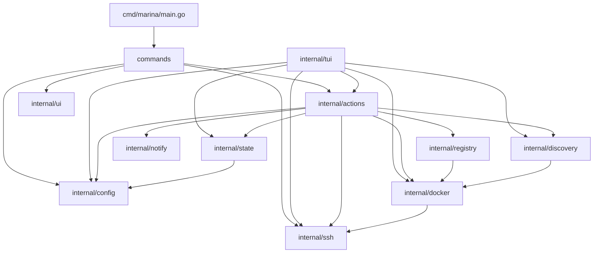

# Marina — Repo Map

**Generated**: 2026-04-17  
**Reviewer**: Team Lead (Phase 0)

---

## Module & Runtime

| Field | Value |
|-------|-------|
| Module path | `github.com/AhmedAburady/marina` |
| Go version | **1.26.2** |
| Entry point | `cmd/marina/main.go` |
| Binary name | `marina` |

---

## Entry Point

`cmd/marina/main.go` (25 LOC): bootstraps `fang.Execute` wrapping a Cobra root command. Registers `os.Interrupt` + `syscall.SIGTERM` signal handling. `version` injected at build time via `-ldflags "-X main.version=..."`.

---

## Package Tree (Mermaid)

---

## LOC per Top-Level Package

| Package | LOC |
|---------|-----|
| `internal/tui` | 4 769 |
| `commands` | 1 812 |
| `internal/actions` | 574 |
| `internal/registry` | 503 |
| `internal/ssh` | 254 |
| `internal/ui` | 247 |
| `internal/config` | 150 |
| `internal/docker` | 126 |
| `internal/state` | 114 |
| `internal/discovery` | 93 |
| `internal/notify` | 57 |
| `cmd/marina` | 25 |
| **Total** | **8 724** |

---

## Test Files

**Zero `*_test.go` files found anywhere in the repo.** No test suite exists.

---

## External Dependencies (grouped by purpose)

| Group | Packages |
|-------|----------|
| TUI framework | `charm.land/bubbletea/v2`, `charm.land/bubbles/v2`, `charm.land/lipgloss/v2`, `charm.land/huh/v2`, `charm.land/fang/v2` |
| CLI | `github.com/spf13/cobra`, `github.com/muesli/mango-cobra` |
| Docker | `github.com/docker/docker`, `github.com/docker/cli`, `github.com/docker/go-connections` |
| Registry | `github.com/google/go-containerregistry` |
| SSH | `golang.org/x/crypto` |
| YAML | `go.yaml.in/yaml/v3` |
| Notifications | (custom Gotify client in `internal/notify`) |
| Observability | `go.opentelemetry.io/otel` (pulled in transitively by docker SDK) |
| Utilities | `github.com/mitchellh/go-homedir`, `github.com/dustin/go-humanize` |

---

## Build & CI Observations

- **CI**: `.github/workflows/release.yml` — builds all 6 targets on tag push (`linux/{amd64,arm64}`, `darwin/{amd64,arm64}`, `windows/{amd64,arm64}`)
- **Missing `-trimpath`** in CI build flags (reproducibility gap)
- **No checksum generation** (`sha256sum`) for release artifacts
- **No test step** in CI — zero coverage enforced
- **No lint step** in CI
- No `golangci-lint` config (`.golangci.yml`) found

---

## Key Architectural Signals (for teammates)

1. **Duplication risk**: `commands/updates.go` (585 LOC) vs `internal/tui/updates.go` (711 LOC) — largest files in their respective packages, likely share update logic.
2. **TUI dominates LOC**: `internal/tui` is 55% of all application code.
3. **Actions layer is thin** (574 LOC) relative to the commands (1812) and tui (4769) layers that consume it — duplication pressure is structural.
4. **Zero tests**: no unit, integration, or e2e tests anywhere.
5. **Signal handling**: `syscall.SIGTERM` + `os.Interrupt` registered at binary level via `fang`.
