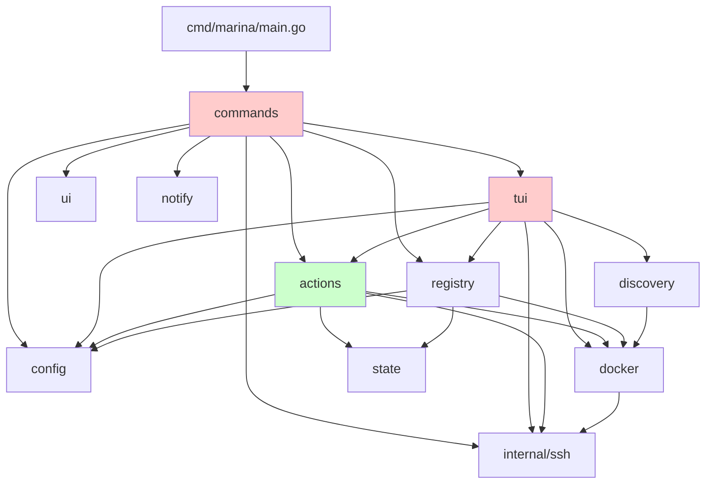

# Marina — Architecture Review

**Reviewer:** marina-architect
**Brief:** package structure, module boundaries, dependency direction, TUI/CLI shared-engine integrity, code duplication, Go idioms.
**Skills loaded:** `golang-pro`, `golang-code-style`, `bubbletea-v2`, `golang-1-26-release`.
**Go release notes consulted:** Go 1.26 (current target), Go 1.21–1.25 minor changes for modernizable idioms (`slices`, `maps`, `range N`, `cmp.Or`, `iter`).

---

## TL;DR

The `internal/actions/` engine is a real, load-bearing layer — most CLI subcommands route through it cleanly (`hosts`, `ps`, `stacks list/add/rm`, `purge`). But the README's "no drift, no surprises" promise is **structurally violated** in three high-traffic paths:

1. **TUI stack purge bypasses `actions.PurgePlan`** and re-implements the steps inline (P1).
2. **CLI `marina update` and `marina prune` bypass `actions.ComposeOp` / `actions.Prune` / `actions.PruneCommand`** with hand-rolled equivalents (P1).
3. **CLI `update` runs `registry.SaveCache` after a check; TUI does not** — the two paths produce different on-disk state from the same operation (P1).

Plus the standard tax of pre-actions-layer growth: ~120 LOC of host-resolution boilerplate copy-pasted across four CLI commands, four near-identical `firstLine` helpers, two `shellQuote` copies, and two anti-pattern "keep import alive" sentinels. None of these are individually fatal, but together they're the seams where future drift will appear.

---

## Current Package Graph



Green = the shared engine (where logic *should* live). Red = the two front doors that still hold business logic locally.

---

## Findings

### TUI purge re-implements the actions.PurgePlan sequence inline
- **Severity**: P1
- **Category**: architect
- **Location**: `internal/tui/stacks.go:552-571` vs `internal/actions/stacks.go:126-178`
- **Evidence**:
  ```go
  // internal/tui/stacks.go:559
  return tea.Batch(
      SequenceCmds(
          ComposeExecCmd(captured.sshCfg, captured.dir, "down --remove-orphans", "compose.down", key),
          DockerExecCmd(captured.sshCfg, "rm -rf "+shellQuote(captured.dir), "dir.rm", key),
          DockerExecCmd(captured.sshCfg, "docker image prune -f", "image.prune", key),
      ), ...
  )
  ```
  `actions.PurgePlan` already returns this exact ordered list of steps with the right shell-quote guard, and the CLI consumes it (`commands/stacks.go:177`).
- **Why it matters**: The promised single source of truth (`actions/`) exists and the CLI uses it, but the TUI duplicates the sequence. If purge ever grows a step (e.g., volume removal, stack-name normalization), the CLI will pick it up automatically and the TUI silently won't — exactly the drift `actions/` was created to prevent. Go 1.22+ `slices.Collect` over an iterator-shaped `PurgePlan` would make wrapping it in `tea.Cmds` trivial.
- **Recommendation**: Drive the TUI from the same `[]PurgeStep` the CLI uses. Sketch:
  ```go
  // internal/tui/stacks.go
  func (s *stacksScreen) buildPurgeCmd() func() tea.Cmd {
      return func() tea.Cmd {
          steps, err := actions.PurgePlan(s.ctx, s.cfg, "", captured.host, captured.name)
          if err != nil { /* surface in s.notice */ return nil }
          cmds := make([]tea.Cmd, 0, len(steps))
          for _, st := range steps {
              cmds = append(cmds, stepToCmd(st, key)) // wraps Run() into ActionResultMsg
          }
          return tea.Batch(SequenceCmds(cmds...), s.spinner.Tick)
      }
  }
  ```
  Then delete the inline `shellQuote` copy in `internal/tui/stacks.go:627` (also flagged below).
- **Effort**: M

### CLI `marina update` bypasses actions.ComposeOp / actions.Prune
- **Severity**: P1
- **Category**: architect
- **Location**: `commands/updates.go:321-409`
- **Evidence**:
  ```go
  // commands/updates.go:373
  _, err := internalssh.Exec(ctx, sshCfg,
      fmt.Sprintf("cd %s && docker compose pull && docker compose up -d", dir))
  // commands/updates.go:407
  _, err := internalssh.Exec(ctx, sshCfg, "docker image prune -f")
  ```
  Both have shared engine equivalents: `actions.ComposeOp(ctx, sshCfg, dir, "pull && docker compose up -d")` (or two sequenced calls — the TUI uses two) and `actions.Prune(ctx, sshCfg, actions.PruneOptions{ImagesOnly: true})`.
- **Why it matters**: This is the highest-risk drift surface in the codebase. `marina update --all --yes` is the primary scripted entry point — it must produce the *same* on-host effects as the TUI's apply-and-prune sequence. Today the TUI runs `pull` then `up -d` as two distinct compose calls (with stop-on-error semantics from `SequenceCmds`), while the CLI chains them with `&&` in a single shell exec. Different failure surfaces, different audit-log shapes.
- **Recommendation**: Promote the four helpers (`runStackUpdate{,Quiet}`, `runHostPrune{,Quiet}`) into `actions/updates.go` as `ApplyStackUpdate(ctx, sshCfg, dir) error` and have both front doors decorate it (CLI with spinner, TUI with `tea.Cmd`). The `--stream` mode is the only orthogonal concern; pass an `io.Writer` for the streaming variant.
- **Effort**: M

### CLI registry check writes the cache; TUI does not
- **Severity**: P1
- **Category**: architect
- **Location**: `commands/updates.go:460` vs `internal/tui/updates.go:395-400`
- **Evidence**:
  ```go
  // commands/updates.go:460  (CLI)
  _ = registry.SaveCache(cache, "")

  // internal/tui/updates.go:395  (TUI) — no SaveCache call after check
  candidates, check, _, err := registry.BuildChecker(s.ctx, s.cfg, s.cfg.Hosts)
  ```
  The CLI captures the third return (`cache`) and persists it; the TUI discards it with `_`.
- **Why it matters**: `registry.BuildChecker` returns a cache the next run is supposed to start warm against. After a TUI check, the next `marina check` run from the CLI starts cold — and vice-versa is presumably fine, but the asymmetry is invisible to users and silently doubles registry traffic in a typical "I checked it in the dashboard, then cron ran" workflow. Also matches the explicit "no drift" architectural promise.
- **Recommendation**: Lift the `BuildChecker → fan-out → SaveCache` orchestration into `actions/checks.go` (e.g. `RunChecks(ctx, cfg, targets) ([]registry.Result, error)`). The CLI calls it directly inside the spinner; the TUI wraps it as a single `checkerReadyMsg`-style command and continues to surface per-candidate progress via a parallel batch of `checkOneCmd`s if the streaming UX needs it. Either way, `SaveCache` happens in one place.
- **Effort**: M

### Host-target resolution copy-pasted across four CLI commands
- **Severity**: P1
- **Category**: architect
- **Location**: `commands/ps.go:36-56`, `commands/stacks.go:99-120`, `commands/updates.go:514-537`, `commands/prune.go:58-115`
- **Evidence**: Same ~20-line block (`-H` precedence → `--all` → interactive `ui.SelectHost`) appears with minor variations in four files. `commands/updates.go:514` even names it `resolveTargets` but doesn't share it with the others.
- **Why it matters**: Four commands × 20 lines = 80 lines of identical logic. The drift here is already visible: `prune.go` builds `[]*hostContext` while `ps.go`/`stacks.go`/`updates.go` build `map[string]*config.HostConfig`. A new flag (`-H foo,bar` for multi-host) or a new selector contract has to be touched in four places.
- **Recommendation**: Move into `commands/helpers.go`:
  ```go
  func resolveTargets(gf *GlobalFlags, cfg *config.Config) (map[string]*config.HostConfig, error)
  ```
  Use the helper from all four sites. The `[]*hostContext` shape in `prune.go` can be derived from the map at the call site (one loop) — keep `hostContext` as a CLI-only adapter.
- **Effort**: S

### Two definitions of `shellQuote` with identical semantics
- **Severity**: P1
- **Category**: architect
- **Location**: `internal/actions/stacks.go:183-188` and `internal/tui/stacks.go:627-632`
- **Evidence**:
  ```go
  // identical body in both files
  func shellQuote(s string) string {
      if strings.ContainsAny(s, "'\"\\") { return "" }
      return "'" + s + "'"
  }
  ```
- **Why it matters**: A safety guard for `rm -rf` argument quoting. If one copy gains a fix (e.g., reject `$`, backticks, newlines) and the other doesn't, the TUI purge path becomes more permissive than the CLI — exactly the inversion of "no drift" you don't want for a destructive operation.
- **Recommendation**: Export `actions.ShellQuote` and call it from both. (Resolves automatically once finding #1 is fixed and the TUI stops needing its own copy.)
- **Effort**: S

### CLI prune defines its own `pruneCommand` that shadows actions.PruneCommand
- **Severity**: P1
- **Category**: architect
- **Location**: `commands/prune.go:39-50` vs `internal/actions/prune.go:21-32`
- **Evidence**: Both functions return the exact same string for the same flag combination. The CLI was migrated to `actions/` for `Prune()` execution but the command-string builder was left behind, and the file doesn't even import `actions`.
- **Why it matters**: Same drift class as #2. The TUI confirm modal previews the command via `actions.PruneCommand`; the CLI confirm prompt computes its own `what` description from the same flags but the actual command string is built by a parallel function. Two places to keep in sync.
- **Recommendation**: Delete `commands/prune.go:pruneCommand` and call `actions.PruneCommand(actions.PruneOptions{ImagesOnly: imagesOnly, ...})`. While at it, hoist the flags-to-options conversion into `actions/prune.go` so both front doors share the description-text mapping too.
- **Effort**: S

### Four near-identical "first line of error, truncated" helpers
- **Severity**: P2
- **Category**: architect
- **Location**:
  - `commands/updates.go:413` `firstLine(err)` — cap 80 bytes (UTF-8 unsafe, see below)
  - `internal/tui/hosts.go:442` `firstLineOf(err)` — cap 40 bytes
  - `internal/tui/log.go:64` `shortenErr(err, n)` — runes-aware, configurable cap
  - `internal/tui/actions.go:73` `firstChars(s, n)` — runes-aware, no first-line trimming
- **Evidence**: Three of the four trim to "first line + ellipsis"; only the cap differs. `firstLine` and `firstLineOf` both byte-slice the string (`s[:79]`), which can split a multi-byte UTF-8 rune mid-character — a Cyrillic/CJK error message tail will print as `…` plus a broken byte. `shortenErr` does it correctly.
- **Why it matters**: Subtle correctness bug for non-ASCII error text plus three places to keep in sync. The Go 1.21 `strings.Cut` and `utf8.RuneCountInString` would let one shared helper replace all four.
- **Recommendation**: Consolidate into a single `internal/util/errsummary.go` (or live in `actions/`):
  ```go
  func FirstLine(err error, maxRunes int) string {
      if err == nil { return "" }
      s, _, _ := strings.Cut(err.Error(), "\n")
      r := []rune(s)
      if maxRunes > 0 && len(r) > maxRunes {
          return string(r[:maxRunes-1]) + "…"
      }
      return s
  }
  ```
  Delete the four copies; pass the cap at the call site (40 for hosts list, 80 for update warnings, 200 for log entries).
- **Effort**: S

### TUI exec commands discard the screen's context
- **Severity**: P1
- **Category**: architect
- **Location**: `internal/tui/actions.go:61` and `internal/tui/actions.go:85`
- **Evidence**:
  ```go
  out, err := actions.ComposeOp(context.Background(), sshCfg, dir, subCmd)
  return internalssh.Exec(context.Background(), sshCfg, command)
  ```
- **Why it matters**: Every screen carries a `ctx` (see `internal/tui/stacks.go:64`, `internal/tui/updates.go:41`) but `ComposeExecCmd`/`DockerExecCmd` ignore it and pass `context.Background()` to the SSH layer. A user pressing `q`/`ctrl+c` during a slow `compose pull` cannot cancel — the goroutine runs to completion, then the program exits with the result discarded. Also breaks any future per-screen timeout.
- **Recommendation**: Thread `ctx` through:
  ```go
  func ComposeExecCmd(ctx context.Context, sshCfg internalssh.Config, ...) tea.Cmd {
      return func() tea.Msg {
          out, err := actions.ComposeOp(ctx, sshCfg, dir, subCmd)
          ...
      }
  }
  ```
  Update the seven call sites to pass `s.ctx`. (Note: bubbletea v2 itself supports `tea.WithContext` for program-level cancellation; combining the two gives both ^C-from-status-bar and per-action cancellation.)
- **Effort**: S

### "Keep import alive" sentinels — dead-code anti-pattern
- **Severity**: P3
- **Category**: architect
- **Location**: `internal/tui/updates.go:711`, `internal/tui/actions.go:123`, `internal/tui/log.go:77`
- **Evidence**:
  ```go
  // internal/tui/updates.go:711
  var _ = config.Load
  // internal/tui/actions.go:123
  var _ = internalssh.Config{}
  // internal/tui/log.go:77
  _ = fmt.Sprintf // keep fmt import usable for future helpers
  ```
- **Why it matters**: All three are referenced *elsewhere in the same package* (e.g., `internal/tui/loaders.go` imports `config`; `internal/tui/log.go:42` calls `fmt.Sprintf` directly). The sentinels are not load-bearing — they're cargo-culted blank assignments left over from a refactor. Goimports would have removed the imports cleanly if they were unused; since they're used, the sentinels are dead code that confuses readers.
- **Recommendation**: Delete all three lines. Trust the toolchain.
- **Effort**: S

### `commands/updates.go` is the largest file at 585 LOC and mixes five concerns
- **Severity**: P2
- **Category**: architect
- **Location**: `commands/updates.go` (whole file)
- **Evidence**: One file holds: cobra wiring (`newCheckCmd`/`newUpdateCmd`), check orchestration (`runChecks`), apply orchestration (`runUpdateApply` with three modes: single-host spinner, multi-host parallel, no-op-with-prune), per-stack/per-host workers (`runStackUpdate{,Quiet}`, `runHostPrune{,Quiet}`), notification rendering (`sendNotifySummary`), display helpers (`statusText`, `printUpdateTable`, `firstLine`).
- **Why it matters**: Five concerns in one file; cyclomatic complexity in `runUpdateApply` is high (nested switch + two parallel goroutine pools + post-apply prune branch). Hard to test, hard to refactor — every change touches everyone else's code.
- **Recommendation**: After fixing #2 and #3, this file naturally splits:
  - cobra wiring → stays in `commands/updates.go` (≤80 LOC)
  - apply orchestration → `actions/updates.go`
  - notification rendering → `commands/notify.go` or absorbed into `internal/notify/`
  - display helpers → `internal/ui/updates.go`
- **Effort**: M

### Pre-1.21 sort idioms used in 11 files; modernizable to `slices.SortFunc` / `slices.Sort`
- **Severity**: P3
- **Category**: architect
- **Location**: 17 occurrences across 11 files (e.g. `commands/updates.go:105`, `internal/tui/stacks.go:363`, `internal/actions/hosts.go:35`)
- **Evidence**:
  ```go
  // commands/updates.go:105
  sort.Slice(results, func(i, j int) bool {
      if results[i].Host != results[j].Host { return results[i].Host < results[j].Host }
      ...
  })
  // internal/actions/hosts.go:35
  sort.Slice(out, func(i, j int) bool { return out[i].Name < out[j].Name })
  ```
- **Why it matters**: Module targets `go 1.26.2` (`go.mod:3`) and CLAUDE.md notes "modern idioms". `slices.SortFunc` (Go 1.21) is type-safe, reads better, and `cmp.Or` (Go 1.22) eliminates the cascade-of-`if`s pattern. `sort.Strings(s)` becomes `slices.Sort(s)`. `range len(ws)` (Go 1.22) lets you drop a temporary length variable.
- **Recommendation**: Bulk migration with `go fix` (now reborn as the modernizer hub in Go 1.26 — see release notes):
  ```bash
  go fix -mod=mod ./...   # applies the slicessort/slicessort modernizers
  ```
  Spot-check the result and commit. Manual example:
  ```go
  // before
  sort.Slice(results, func(i, j int) bool {
      if results[i].Host != results[j].Host { return results[i].Host < results[j].Host }
      if results[i].Stack != results[j].Stack { return results[i].Stack < results[j].Stack }
      return results[i].Container < results[j].Container
  })
  // after (Go 1.22+)
  slices.SortFunc(results, func(a, b registry.Result) int {
      return cmp.Or(
          cmp.Compare(a.Host, b.Host),
          cmp.Compare(a.Stack, b.Stack),
          cmp.Compare(a.Container, b.Container),
      )
  })
  ```
- **Effort**: S

### TUI screens import `internal/discovery` directly; CLI routes through `actions`
- **Severity**: P2
- **Category**: architect
- **Location**: `internal/tui/stacks.go:380` (calls `discovery.GroupByStack` directly) — same pattern in `commands/stacks.go:141`, but at least both go via `actions.FetchAllHosts` first
- **Evidence**:
  ```go
  // internal/tui/stacks.go:380
  for _, st := range discovery.GroupByStack(host, res.Containers, hostCfg.Stacks) { ... }
  // commands/stacks.go:141
  all = append(all, discovery.GroupByStack(label, r.Containers, cfg.Hosts[name].Stacks)...)
  ```
- **Why it matters**: Both front doors call the same primitive, so it's not drift today — but `actions/` is supposed to be the boundary, and `discovery` is a step deeper. Putting `actions.GroupedStacks(host, res, hostCfg)` in `actions/stacks.go` (or extending `FetchAllHosts` to return groups) lets the screens depend only on `actions/` + `config/`, which is the dependency direction the architecture promises.
- **Recommendation**: Add `actions.StackGroupsFor(host, result, hostCfg) []discovery.Stack` (a one-liner forwarder is fine) and have both front doors call it. Optional next step: wrap `discovery.Stack` itself in an actions-owned type so the TUI/CLI never reaches into the internal package.
- **Effort**: S

### Modernizable: range-over-map collection with `maps.Keys` + `slices.Collect` / `slices.Sorted`
- **Severity**: P3
- **Category**: architect
- **Location**: 7 sites including `commands/updates.go:119-123`, `commands/prune.go:79-83`, `commands/ps.go:62-67`, `commands/stacks.go:108-112`
- **Evidence**: Same ~5-line pattern everywhere:
  ```go
  hostNames := make([]string, 0, len(cfg.Hosts))
  for name := range cfg.Hosts { hostNames = append(hostNames, name) }
  sort.Strings(hostNames)
  ```
- **Why it matters**: Go 1.23's `slices.Sorted(maps.Keys(m))` collapses three lines to one. Five iterations of a four-line block in the codebase ⇒ ~20 lines deleted, plus one less place to forget the sort. Cited in Go 1.23 release notes (`maps.Keys` returns `iter.Seq`).
- **Recommendation**: After fixing #4 (which deletes most of these), apply to the survivors:
  ```go
  hostNames := slices.Sorted(maps.Keys(cfg.Hosts))
  ```
- **Effort**: S

### `internal/tui/actions.go` mixes raw and structured exec paths with conflicting guidance
- **Severity**: P2
- **Category**: architect
- **Location**: `internal/tui/actions.go:32-50`
- **Evidence**:
  ```go
  // Note: historically this accepted a free-form command string; that form is
  // retained for compatibility with the Updates screen's multi-step pull+up.
  // New callers should prefer actions.ContainerOp / actions.ComposeOp.
  func DockerExecCmd(sshCfg internalssh.Config, command, kind, target string) tea.Cmd { ... }
  ```
  But every active caller still uses the free-form path: `internal/tui/stacks.go:565` (`rm -rf`), `:566` (`docker image prune -f`), `internal/tui/updates.go:620` (`docker image prune -f`).
- **Why it matters**: The doc comment promises a migration that hasn't happened. Either complete it (split `DockerExecCmd` into typed helpers — `RmCmd`, `PruneCmd` — backed by the actions package) or delete the comment so future readers don't think there's already a structured surface to use. Today the comment is aspirational and the code is the workaround.
- **Recommendation**: Once #1 lands (TUI uses `PurgePlan`), the only remaining free-form caller is `image prune -f` which has a perfect actions equivalent. Migrate it, then narrow `DockerExecCmd` to a private `rawExecCmd` that's only used internally for compatibility.
- **Effort**: S

---

## Routed to teammates

- **runtime (#2)**: `commands/updates.go:225-275` runs N goroutines per host with a shared mutex for stdout but no `errgroup`/context cancellation. Worth a concurrency-correctness pass (likely already in scope).
- **runtime (#2)**: `internal/tui/actions.go:61,85` — `context.Background()` discards screen ctx (see finding "TUI exec commands discard the screen's context"). Cancellation impact is more in your lane than mine.
- **io-security (#3)**: `actions.PurgePlan`'s `dir.rm` step runs `rm -rf <quoted dir>` on the remote — `shellQuote` rejects `'` `"` `\` but not `$`, backticks, `;`, newlines. Worth confirming the threat model. (Sent to architect lens because of duplication; the safety analysis is yours.)
- **qa (#5)**: zero `*_test.go` files in the repo; mentioned for completeness, not double-reporting.

---

## Closing

The architecture is sound — `internal/actions/` is a real engine with real callers, and the dependency direction is mostly right. The work to do is *finishing* the migration: three more functions need to move into `actions/`, the four duplicated host-resolution blocks need a shared helper, and the four error-summary helpers need to become one. After that the "no drift" promise is structurally enforced rather than aspirational, and `commands/updates.go` will shrink from 585 LOC to something a human can read in one sitting.
