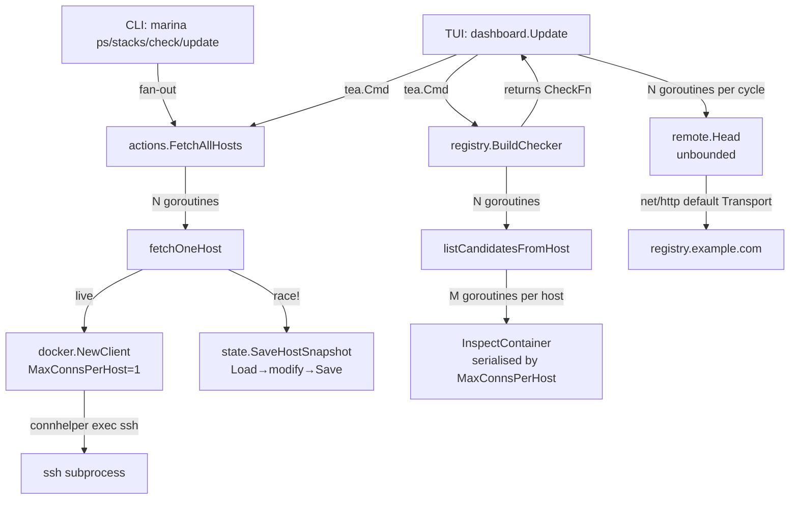

# Marina Runtime Review

**Reviewer**: runtime-guy
**Scope**: performance hot paths, goroutine lifecycle, race conditions, channel/mutex discipline, context propagation, BubbleTea v2 `Update`-loop cost, SSH connection reuse, registry HEAD de-duplication, `state.json` write cadence.

**Skills loaded**: `golang-pro`, `golang-performance`, `bubbletea-v2`, `golang-1-26-release`.
**Go release notes consulted**: 1.26 (release notes loaded). Marina targets `go 1.26.2` (`go.mod:3`). Modern idioms applicable here: `errors.AsType` (1.26), `slog.NewMultiHandler` (1.26), `runtime/pprof goroutineleak` profile (1.26 experiment), `B.Loop` benchmarks (1.24+, fixed in 1.26), `sync.OnceFunc` / `OnceValue` (1.21+), range-over-func iterators + `maps`/`slices` (1.23+), `sync.Map.Clear` (1.23), `errgroup.WithContext` for bounded fan-out.

---

## Concurrency map



---

## Findings

### Concurrent `state.SaveHostSnapshot` calls race and corrupt the cache file
- **Severity**: P0
- **Category**: runtime
- **Location**: `internal/state/state.go:104-114`, called from `internal/actions/fetch.go:79`
- **Evidence**:
  ```go
  // fetch.go:53 — every host goroutine calls this concurrently
  _ = state.SaveHostSnapshot(host, &state.HostSnapshot{...}, "")

  // state.go:105 — load → modify → save with no lock, no atomic rename
  func SaveHostSnapshot(hostName string, snapshot *HostSnapshot, path string) error {
      store, err := Load(path)        // ← reads current file
      ...
      store.Hosts[hostName] = snapshot // ← in-memory mutation
      return Save(store, path)         // ← os.WriteFile, non-atomic
  }
  ```
- **Why it matters**: `FetchAllHosts` spawns one goroutine per target host (`fetch.go:51-57`), each of which calls `SaveHostSnapshot` after a successful live fetch. The function is a load-modify-write against the same `~/.config/marina/state.json` with **no mutex and no atomic temp-file-then-rename**. With N hosts you get N concurrent reads of the same file, each merging only its own host into a stale snapshot, then `os.WriteFile` blasts whichever finishes last — silently dropping the other N-1 updates. Crash mid-`os.WriteFile` truncates the cache to a partial JSON document that `Load` then fails on (caller swallows the error and starts fresh, but every recent snapshot is lost). The state cache is the documented offline fallback (`CLAUDE.md`: "essential for diagnosing"); cache correctness is a correctness concern, not just performance.
- **Recommendation**:
  1. Hoist persistence out of the fan-out: in `FetchAllHosts`, after the `for r := range ch` collection loop, do **one** `state.Load` → merge all live results → **one** `state.Save`.
  2. Make `state.Save` atomic: write to `path+".tmp"`, then `os.Rename` (POSIX-atomic on the same filesystem). Otherwise a SIGINT during write leaves a corrupt file.
  3. If per-goroutine writes must stay, wrap with a package-level `sync.Mutex` keyed on the path.
- **Effort**: S

### Tea cmd actions ignore the dashboard context — no cancellation for slow remote ops
- **Severity**: P1
- **Category**: runtime
- **Location**: `internal/tui/actions.go:39-86` (`DockerExecCmd`, `ComposeExecCmd`, `rawExec`)
- **Evidence**:
  ```go
  // actions.go:60-61
  func ComposeExecCmd(sshCfg internalssh.Config, dir, subCmd, kind, target string) tea.Cmd {
      return func() tea.Msg {
          ...
          out, err := actions.ComposeOp(context.Background(), sshCfg, dir, subCmd)
  // actions.go:85
  func rawExec(sshCfg internalssh.Config, command string) (string, error) {
      return internalssh.Exec(context.Background(), sshCfg, command)
  }
  ```
  Grep confirms `context.Background()` only at `internal/tui/actions.go:61` and `:85` plus `cmd/marina/main.go:19`.
- **Why it matters**: `Run(ctx, cfg)` (`internal/tui/run.go:15-20`) plumbs a context all the way to every screen, but the action layer throws it away. A `compose pull` against a slow registry can block for minutes; the user pressing `esc`/`ctrl+c` cannot interrupt it because `internalssh.Exec` only honours its own ctx. The brief calls out cancellation on `esc`/Ctrl+C mid-operation as a key Marina runtime concern. Worse, every in-flight tea.Cmd holds an SSH subprocess open after the program exits — they only die when the remote command finishes or the SSH connection times out.
- **Recommendation**: Thread the screen's `s.ctx` through `DockerExecCmd`/`ComposeExecCmd`/`rawExec`. Each accepts a `context.Context` parameter and forwards it to `actions.ComposeOp` / `internalssh.Exec`. The screen already has `s.ctx`; the call sites just need to pass it (`updates.go:580-583`, `containers.go:327-417`, `stacks.go:427-566`). For per-action timeouts, derive `ctx, cancel := context.WithTimeout(s.ctx, ...)` inside the closure and `defer cancel()`.
- **Effort**: S

### `BuildChecker` aborts the entire updates check on a single host failure
- **Severity**: P1
- **Category**: runtime
- **Location**: `internal/registry/check.go:53-60` and `:154-165`
- **Evidence**:
  ```go
  // check.go:57-60
  candidates, err = gatherCandidates(ctx, cfg, targets)
  if err != nil {
      return nil, nil, nil, err   // ← whole pass dead on first per-host err
  }

  // check.go:154-164 — gatherCandidates returns the FIRST error, drops all
  // partial host results that came in before/after it
  for r := range ch {
      if r.err != nil {
          if firstErr == nil {
              firstErr = fmt.Errorf("host %q: %w", r.host, r.err)
          }
          continue
      }
      all = append(all, r.items...)
  }
  ```
- **Why it matters**: The brief explicitly states "partial failure (one host unreachable) must not break the whole operation." `FetchAllHosts` honours this contract — `BuildChecker` does not. One unreachable host (transient SSH failure, DNS hiccup) blanks the entire Updates screen and the `marina check` CLI, even though the check did successfully gather candidates from every other host. This regresses the user experience that the `state.json` cache fallback was specifically designed to preserve.
- **Recommendation**: Return `(candidates, firstErr)` from `gatherCandidates` and let `BuildChecker` accept partial results — return `(candidates, checkFn, nil, nil)` when at least one host produced data, and surface per-host errors as `Result` rows with `Status: "host unreachable"` so the UI shows them individually rather than failing the whole pass. Mirror the per-host error placeholder pattern already used in `internal/tui/containers.go:336-345`.
- **Effort**: S

### Per-host inspect goroutines waste concurrency — `MaxConnsPerHost: 1` serialises them
- **Severity**: P2
- **Category**: runtime
- **Location**: `internal/registry/check.go:188-215`, `internal/docker/client.go:44`
- **Evidence**:
  ```go
  // check.go:189-215 — spawns one goroutine per unique image
  cache := make(map[string]docker.ImageMeta)
  var mu sync.Mutex
  var wg sync.WaitGroup
  for _, c := range containers {
      ...
      wg.Add(1)
      go func(id, fallbackImage string, cID string) {
          defer wg.Done()
          meta, err := dc.InspectContainer(ctx, cID)
          mu.Lock(); cache[id] = meta; mu.Unlock()
      }(...)
  }
  wg.Wait()

  // client.go:44
  MaxConnsPerHost: 1, // Force all requests through one SSH pipe
  ```
- **Why it matters**: The transport's `MaxConnsPerHost: 1` means every concurrent `InspectContainer` call queues on a single SSH pipe — the goroutines run *in lockstep*, not in parallel. The fan-out adds: (a) goroutine creation + scheduling overhead per image, (b) lock contention on `mu`, (c) unbounded goroutine count for big container counts. For a host with 80 unique images you spawn 80 goroutines that execute strictly sequentially through one pipe.
- **Recommendation**: Replace the goroutine-per-image with a sequential loop. The map and mutex disappear:
  ```go
  cache := make(map[string]docker.ImageMeta, len(containers))
  for _, c := range containers {
      if c.State != "running" || cache[c.ImageID].Ref != "" { continue }
      meta, _ := dc.InspectContainer(ctx, c.ID)
      if meta.Ref == "" { meta.Ref = c.Image }
      cache[c.ImageID] = meta
  }
  ```
  Same wall-clock latency, fewer allocations, no lock, no `sync.WaitGroup`. If you ever raise `MaxConnsPerHost`, reintroduce a bounded pool with `golang.org/x/sync/errgroup` + `SetLimit(N)` instead of unbounded goroutines.
- **Effort**: S

### CLI `runChecks` fan-out is unbounded — N HEADs to registry simultaneously
- **Severity**: P2
- **Category**: runtime
- **Location**: `commands/updates.go:448-457`
- **Evidence**:
  ```go
  results := make([]registry.Result, len(candidates))
  var wg sync.WaitGroup
  for i, c := range candidates {
      wg.Add(1)
      go func(idx int, cand registry.Candidate) {
          defer wg.Done()
          results[idx] = check(ctx, cand)
      }(i, c)
  }
  wg.Wait()
  ```
- **Why it matters**: With N containers across the homelab (easily 100+), this fires N concurrent `remote.Head` requests through `net/http`'s default transport (`MaxIdleConnsPerHost = 2`). Docker Hub will rate-limit (HTTP 429); the in-cycle `sync.Map` dedup helps for shared images but does nothing across distinct images. This is exactly the "default `http.Client` without Transport" anti-pattern called out in the `golang-performance` skill, plus an unbounded goroutine fan-out on the user's machine.
- **Recommendation**: Bound concurrency with `golang.org/x/sync/errgroup`:
  ```go
  g, gctx := errgroup.WithContext(ctx)
  g.SetLimit(8)  // tune; 8 is plenty against one registry
  for i, c := range candidates {
      i, c := i, c
      g.Go(func() error { results[i] = check(gctx, c); return nil })
  }
  _ = g.Wait()
  ```
  Pair with a configured `http.Transport` (`MaxIdleConnsPerHost`, `MaxConnsPerHost`) inside `internal/registry` so connections are reused across HEADs to the same registry host.
- **Effort**: S

### `SaveCache` always writes a nil cache → useless `null` JSON file each `marina check` run
- **Severity**: P2
- **Category**: runtime
- **Location**: `commands/updates.go:460`, `internal/registry/check.go:51-60`, `internal/registry/cache.go:43-86`
- **Evidence**:
  ```go
  // check.go:55-56 — the doc comment is explicit
  // The returned *Cache is nil; it exists only so existing call sites keep compiling.
  ...
  return candidates, checkFn, nil, nil  // cache always nil

  // updates.go:460
  _ = registry.SaveCache(cache, "")  // serialises a nil *Cache → "null"
  ```
- **Why it matters**: Every `marina check` / `marina update` run writes the literal bytes `null` to `~/.config/marina/check-cache.json`. `LoadCache` survives that (it falls through to the corrupt-cache branch and returns an empty cache), but the file is misleading garbage on disk and the entire `internal/registry/cache.go` (Lookup/Store/InvalidateRef/CacheTTL) is dead code that no production path calls. Dead code with file-system side effects is easy to misread when debugging.
- **Recommendation**: Either (a) delete the call site and `internal/registry/cache.go` entirely (the in-cycle `sync.Map` dedup in `check.go` is the only cache contract Marina actually keeps), or (b) wire `Cache` back into `BuildChecker` if the persistent cache is wanted. The current half-state is the worst of both worlds. Given the `check.go` doc comment ("No persistent cache — every check cycle hits the registry fresh"), option (a) is correct.
- **Effort**: S

### `updatesScreen` filter/select helpers are O(N²) on every key
- **Severity**: P2
- **Category**: runtime
- **Location**: `internal/tui/updates.go:474-510`, `:664-680`
- **Evidence**:
  ```go
  // absoluteIndex walks the entire results slice, applying filter predicates
  func (s *updatesScreen) absoluteIndex(visibleIdx int) int {
      seen := 0
      for i, r := range s.results { ... if seen == visibleIdx { return i }; seen++ }
  }

  // toggleAll calls absoluteIndex inside a loop over filteredItems()
  for i := range items {
      if !s.selected[s.absoluteIndex(i)] { allOn = false; break }
  }
  ...
  for i := range items { s.selected[s.absoluteIndex(i)] = true }
  ```
  Plus `pendingApply` (`:664`) and `uniqueAppliedHosts` (`:630`) each walk `s.results` per call, and they are called per `SequenceResultsMsg` arrival.
- **Why it matters**: Every cursor move calls `filteredItems()` (`:296`); every `space`/`a` press calls `absoluteIndex` inside a loop over filtered items, giving O(N²) work where N is the candidate count. With 100+ containers each press redoes the filter predicate hundreds of times. Inside the BubbleTea `Update` loop this directly delays repaints — the framework can't render the next frame until `Update` returns. The `bubbletea-v2` skill's PATTERNS guidance is "no blocking work inside `Update`."
- **Recommendation**: Build the filtered view once per state change and store both `visible` (the filtered slice) and `visibleToAbs` (a parallel `[]int` index back to `s.results`). Rebuild only on filter-text change, `t` toggle, or new results — not on every cursor move. The `containersScreen` and `stacksScreen` already do this (`s.visible`, `rebuildVisible()`); apply the same pattern in `updatesScreen` for consistency.
- **Effort**: S

### Fan-out duplicated across actions/check — collapse with `errgroup` and Go 1.23 iterators
- **Severity**: P3
- **Category**: runtime
- **Location**: `internal/actions/fetch.go:39-67`, `internal/registry/check.go:129-166`, `commands/updates.go:230-275`, `:301-313`
- **Evidence**: Three near-identical fan-out shapes (`wg.Add(1) → goroutine → ch ← result`, then `go func() { wg.Wait(); close(ch) }()`, then range over chan). All silently swallow context cancellation — none honour `ctx.Done()` while waiting for the channel.
- **Why it matters**: Maintenance drag (each new fan-out reinvents the pattern), no shared place to add tracing/metrics/concurrency limits, and the manual `wg + close(ch)` goroutine is a known footgun. None of the three honours `ctx.Done()` during `range ch`, so a cancelled context still waits for every host.
- **Recommendation**: Extract a single helper `actions.FanOut[T any](ctx, items, fn) iter.Seq2[K, T]` returning a Go 1.23 range-over-func iterator over completed results, backed by `errgroup.Group`. Caller iterates results as they arrive and breaks on `ctx.Err()`. That single helper replaces all three fan-out blocks. Bonus: pairs nicely with the proposed bounded-concurrency limit for the registry HEAD path.
- **Effort**: M

### `tea.NewProgressBar` allocated every frame in dashboard render
- **Severity**: P3
- **Category**: runtime
- **Location**: `internal/tui/dashboard.go:114-124`
- **Evidence**:
  ```go
  if pr, ok := m.top().(ProgressReporter); ok {
      if frac, active := pr.Progress(); active {
          pct := int(frac * 100)
          ...
          v.ProgressBar = tea.NewProgressBar(tea.ProgressBarDefault, pct)
      }
  }
  ```
- **Why it matters**: `View()` runs at the program's frame rate (default 60 Hz). `tea.NewProgressBar` allocates a fresh value every render even when `pct` hasn't changed. Tiny absolute cost, but noisy in allocation profiles when investigating other issues, and easy to fix.
- **Recommendation**: Cache a `tea.ProgressBar` on the dashboard, only mutate when `pct` differs from the cached value. Or, more idiomatic Go 1.21+: stash with `sync.OnceValue` for the static config and only swap the percentage.
- **Effort**: S

---

## Routed to teammates

- **io-security** (`SendMessage` → `io-security`): `state.Save` is non-atomic (`os.WriteFile`, no temp+rename) — security/cache-correctness adjacent to my P0 race finding. Worth a second look from the I/O lens.
- **reliability-master**: `BuildChecker` fail-closed-on-first-host violates the partial-failure contract that `FetchAllHosts` honours. My P1 finding overlaps your brief; flagging so we don't double-report without coordination.
